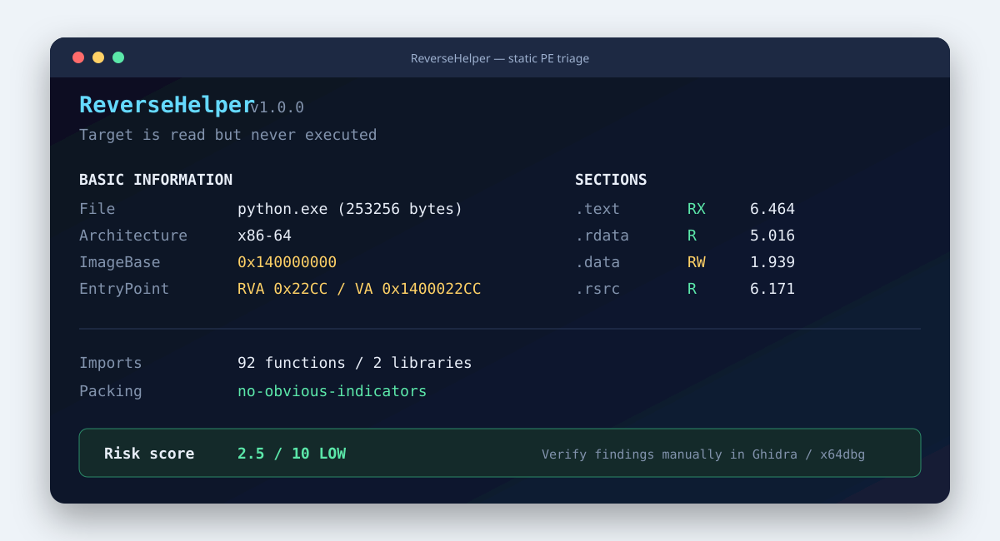

# ReverseHelper

> A practical reverse engineering assistant for CTF analysis and learning.

[](https://github.com/NingWen2000/ReverseHelper/actions/workflows/tests.yml)
[](https://www.python.org/)
[](LICENSE)

ReverseHelper 是一个面向 CTF Reverse、CrackMe 学习与 Windows PE 初步排查的静态分析工具。它把 PE 结构、导入导出、字符串、节区异常、加壳信号和常见密码学常量整理成一份可解释的终端结果与分析报告。

**安全边界：ReverseHelper 只读取文件，不会运行目标程序。风险分数和加壳判断都是启发式提示，不是恶意性结论。**



## 功能

- PE 基础信息：Machine、ImageBase、EntryPoint、Subsystem、时间戳、哈希
- 节区分析：RVA/RAW、大小、权限、Shannon Entropy、RWX 异常
- Import / Export Table：导入库、函数、导出符号
- 可疑 API 分类：进程注入、动态加载、执行、反调试、网络、持久化等
- 字符串提取：ASCII、UTF-16LE，以及 URL、命令、凭据、调试、网络、CTF 规则分类
- 加壳启发式：UPX/常见壳节名、高熵、异常入口点、少量导入、巨大 Overlay
- 密码学常量：AES S-box/Rcon、TEA delta、MD5 IV、CRC32 polynomial
- 可解释风险评分：展示每一项加分原因，结果限制为 `0–10`
- 报告输出：Markdown、JSON、独立 HTML
- Ghidra 脚本：可疑字符串注释、密码学常量注释、调用方辅助重命名、Markdown 摘要导出

## 快速开始

要求 Windows、Linux 或 macOS 上的 Python 3.10+。分析对象必须是 Windows PE 文件。

```powershell
git clone https://github.com/NingWen2000/ReverseHelper.git
cd ReverseHelper
python -m venv .venv
.\.venv\Scripts\Activate.ps1
python -m pip install -e .
```

分析一个文件：

```powershell
reversehelper .\sample.exe
```

如果不安装为命令，也可以直接运行：

```powershell
python main.py .\sample.exe
```

同时生成 Markdown、JSON 和 HTML 报告：

```powershell
reversehelper .\sample.exe --report
```

指定报告目录或单独输出一种格式：

```powershell
reversehelper .\sample.exe --report .\reports
reversehelper .\sample.exe --json .\reports\result.json --quiet
reversehelper .\sample.exe --html .\reports\result.html
```

查看全部参数：

```powershell
reversehelper --help
```

## 示例输出

```text
ReverseHelper v1.0.0
Static Windows PE triage - target is never executed

File          python.exe (253256 bytes)
Type          EXE
Architecture  x86-64
ImageBase     0x140000000
EntryPoint    RVA 0x22CC / VA 0x1400022CC

Sections      .text  .rdata  .data  .pdata  .rsrc  .reloc
Imports       92 functions from 2 libraries
Packing       no-obvious-indicators
Risk score    2.5/10 LOW
```

## Ghidra 脚本

仓库的 [`scripts`](scripts/README.md) 目录包含四个脚本：

| 脚本 | 用途 |
|---|---|
| `FindSuspiciousStrings.py` | 分类 Ghidra 已识别的字符串并添加 Plate Comment |
| `FindCryptoConstants.py` | 查找 TEA、MD5、CRC32 常量并添加注释 |
| `AutoRename.py` | 根据高信号导入 API 辅助重命名默认函数名 |
| `ExportAnalysisReport.py` | 导出内存块和函数摘要为 Markdown |

在 Ghidra 的 **Script Manager → Script Directories** 中添加本仓库的 `scripts` 目录，刷新后即可在 `ReverseHelper` 分类下运行。自动重命名会修改当前 Ghidra 工程，建议先保存工程快照。

## 项目结构

```text
ReverseHelper/
├── main.py                  # 源码目录直接运行入口
├── reversehelper/           # Python 分析引擎与 CLI
├── scripts/                 # Ghidra 自动化脚本
├── tests/                   # 单元测试与 Windows PE 集成测试
├── docs/                    # 设计与分析示例
├── notes/                   # 可复用的开发与验证记录
├── samples/                 # 仅保存样本使用说明，不提交二进制
├── reports/                 # 本地生成报告，默认不进入 Git
└── screenshots/             # README 展示资源
```

核心设计说明见 [`docs/design.md`](docs/design.md)，已验证的分析示例见 [`docs/analysis-example.md`](docs/analysis-example.md)。

## 测试

```powershell
python -m pip install -r requirements-dev.txt
python -m pytest --cov=reversehelper
```

测试不会下载或执行恶意样本。Windows 集成测试只读取当前 Python 解释器的 PE 文件；其他平台会自动跳过该项。

## 如何解读结果

- `high entropy` 可能来自压缩、加密、资源或正常编译产物，不能单独证明加壳。
- `RWX` 节区值得检查，但部分 JIT/保护软件会合理使用这类权限。
- 可疑 API 只说明程序具备某种能力，不能说明它实际调用或恶意使用该能力。
- 密码学常量是字节签名匹配，短常量存在碰撞可能，应回到交叉引用与反编译代码验证。
- 风险评分用于安排人工分析优先级，不是杀毒引擎评分。

推荐分析路径：

```text
ReverseHelper 静态初筛
        ↓
Ghidra 确认入口点、交叉引用和控制流
        ↓
x64dbg/x32dbg 在隔离环境中动态验证
        ↓
形成可复现的分析结论
```

## 路线图

- [x] PE Header、Sections、IAT/EAT
- [x] ASCII / UTF-16LE 与可疑字符串
- [x] Entropy、UPX/节区/入口点异常
- [x] AES、TEA、MD5、CRC 常量
- [x] Markdown / JSON / HTML 报告
- [x] Ghidra 自动注释与辅助重命名
- [ ] PEiD/YARA 可选规则包
- [ ] Rich TUI 交互视图
- [ ] 批量目录分析与结果对比
- [ ] CFG 与调用图摘要

## 合法与安全使用

本项目仅用于授权的安全研究、CTF、教学和自有软件分析。不要向公开仓库提交比赛中的 Flag、私有题目附件、恶意样本、凭据或个人数据。对未知文件进行动态调试时，请使用隔离虚拟机。

## License

[MIT License](LICENSE)
